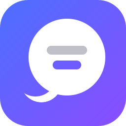
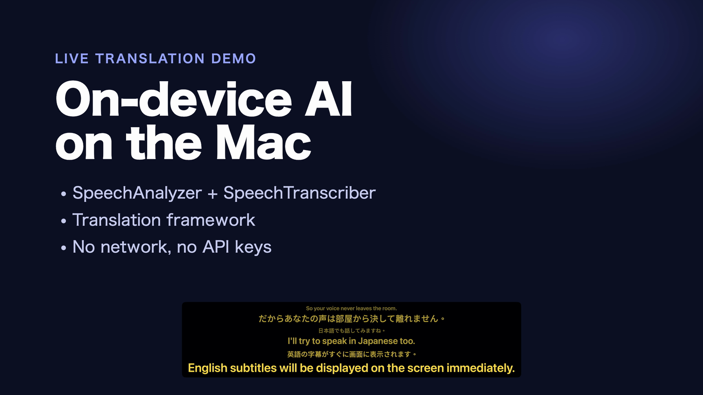
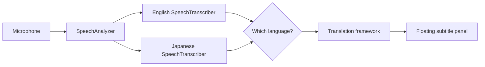

<p align="center">
  
</p>

<h1 align="center">Live Translation</h1>

<p align="center">
  Live English ⇄ Japanese subtitles for your talks.<br>
  Runs entirely on your Mac. No account, no API key, no audio sent anywhere.
</p>

<p align="center">
  
  
  
</p>

https://github.com/user-attachments/assets/42972199-68cc-44fa-959b-e39428b3bcde

Speak English and Japanese subtitles appear over your slides. Switch to Japanese mid-talk and the subtitles switch to English. You don't press anything.



## Why Live Translation

- **Fully local.** Apple's Speech framework transcribes and Apple's Translation framework translates, both on device. Your voice never leaves the Mac, and once the models are installed it works with Wi-Fi off.
- **Both directions, no switching.** The app works out whether each sentence is English or Japanese and translates it the other way.
- **Updates while you talk.** The subtitle appears as you speak and catches up about once a second, so the audience isn't waiting for you to finish a sentence.
- **Stays on top of full-screen slides.** Keynote, PowerPoint, or a browser in full screen. Clicks pass through to the slides underneath.
- **Easy to follow.** The two previous sentences stay on screen, smaller and dimmer, for anyone who looked away.
- **Your style.** Four presets plus custom font, size, colors, and whether the original sentence shows above the translation.

## Install

You need macOS 26.4 or later, Xcode 26, and a microphone. A Mac mini has no built-in mic, so connect AirPods, a USB mic, or an iPhone.

```sh
brew install xcodegen
git clone https://github.com/kjj6198/live-translation.git
cd live-translation
xcodegen generate
xcodebuild -scheme LiveTranslation -configuration Release -derivedDataPath build
cp -R build/Build/Products/Release/LiveTranslation.app /Applications/
open /Applications/LiveTranslation.app
```

The app lives in the menu bar and has no window. On the first start, allow microphone access. The app then downloads the English and Japanese speech models.

If the subtitle says a language is "not installed", add English and Japanese in System Settings > General > Language & Region > Translation Languages.

## Usage

Click the captions icon in the menu bar.

- **Start Subtitles** (⌘S) starts listening.
- **I'm Speaking** sets the language you talk in. Pick English or Japanese if you know it. That runs one speech model instead of two and avoids wrong guesses. Detect Automatically handles both.
- **Style** switches between the Classic, High Contrast, Light, and Outline presets.
- **Customize Style…** (⌘,) changes the font, size, text color, background color, and whether the original sentence shows. Changes apply at once and are saved.

Drag the subtitle to move it. The app remembers the position and screen. If it ends up off screen, use "Move Subtitles Back to the Bottom of the Screen" in Customize Style.

## How it works



Everything in this diagram runs on your Mac. The only network use is the one-time model download, which macOS handles.

- Apple's speech models can't tell which language is being spoken. In Detect Automatically mode, the app runs an English and a Japanese `SpeechTranscriber` on the same audio and keeps the transcript with the higher confidence. If the Japanese transcript has no kana or kanji, it keeps the English one, which covers short replies like "Yes".
- The app translates the newest text as soon as the previous translation finishes, so the translation catches up about once a second.
- A subtitle ends when the transcribers stop revising their text for 1.2 s after a finished sentence, or for 3 s when the sentence has no closing punctuation yet, so a pause mid-sentence doesn't split its translation. The app then calls `SpeechAnalyzer.finalize(through:)` to get the final text right away. Mic level isn't used, because a distant or quiet voice barely rises above room noise.
- Each sentence keeps its place in the translation queue, so older sentences still get their final translation after you move on.
- Subtitles clear after 5 s of silence.

## Contributing

Issues and pull requests are welcome. Bug reports are most useful with the language you spoke, what you said, and what the subtitle showed.

- `project.yml` is the source of truth. The `.xcodeproj` is generated and git-ignored, so after adding a file under `LiveTranslation/`, run `xcodegen generate` again.
- Test with a real microphone and real speech. Most of the behavior depends on how the speech models revise their text while you talk.
- Only English and Japanese are supported today. Another language pair needs changes to the language detection in `Language.swift`, so open an issue first to discuss it.
- Keep pull requests focused, and use [Conventional Commits](https://www.conventionalcommits.org/) for commit messages.

## License

[MIT](LICENSE)
